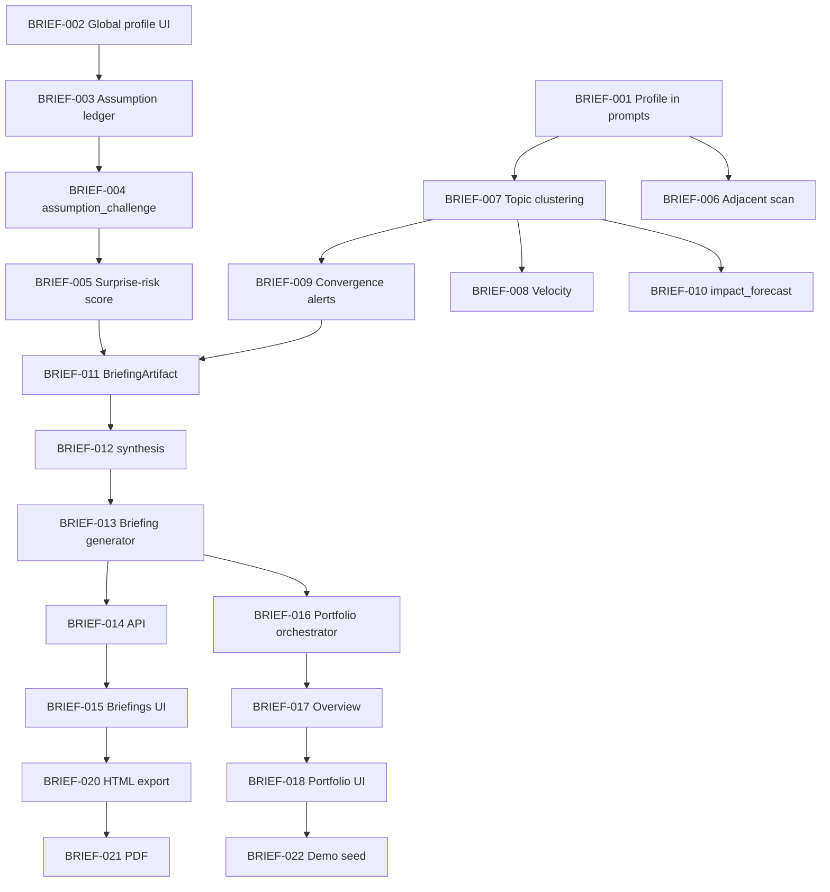

# Linear Project: Company Intelligence Briefings

> **Purpose:** Investor-ready, bulk-generated research intelligence reports per company profile.
> **Status:** Ready to create in Linear once the Linear MCP server is authenticated in Cursor.
> **Source plan:** Briefing architecture discussion (2026-07-23) + existing `ROADMAP.md` phases P2–P6.

---

## How to create in Linear (after MCP auth)

1. In **Cursor → Settings → MCP**, authenticate the **Linear** server.
2. Re-run the agent request: *"Create the Linear project from `LINEAR_BRIEFING_PROJECT.md`"*.
3. Or create manually: **New Project** → copy **Project** block below → create **Milestones** → create **Issues** from the task tables.

**Suggested labels:** `foundation`, `risk`, `radar`, `briefing`, `portfolio`, `export`, `backend`, `frontend`, `llm`

**Suggested priority:** P0 = blocking demo · P1 = core value · P2 = polish · P3 = later

---

## Project

| Field | Value |
|-------|-------|
| **Name** | Company Intelligence Briefings |
| **Summary** | Bulk-generate investor-ready reports that surface scientific trends, strategic dangers, opportunities, and challenged assumptions — one polished briefing per company profile, plus a portfolio overview. |
| **Description** | Extend the Research Paper Analyzer from interactive GUI analysis into a **research intelligence reporting product**. Reuse existing ingestion, deep analysis, company profiles, and strategic-fit scoring. Add corpus-level trend/risk aggregation, repeatable briefing artifacts, multi-company portfolio scans, and exportable narratives with evidence links. Every claim in a briefing must trace to cached papers, analyses, and fit scores. Markdown/HTML is canonical; PDF is a presentation adapter. |
| **Target outcome** | Demo: scan 5–10 company profiles → one evidence-backed briefing each → portfolio landing page showing top opportunities and threats across the set. |

---

## Milestones

| # | Milestone | Goal |
|---|-----------|------|
| M1 | Profile foundation | Company lens applied everywhere |
| M2 | Risk & assumption ledger | Dangers and challenged thesis surfaced structurally |
| M3 | Technology radar | Corpus-level trends, velocity, convergence |
| M4 | Briefing generation | Per-profile narrative artifacts (JSON + Markdown) |
| M5 | Portfolio campaigns | Bulk scan + investor portfolio overview |
| M6 | Export & packaging | Branded export and service-ready delivery |

---

## M1 — Profile foundation

### BRIEF-001 · Thread active profile into relevance + plan_worthy prompts

| Field | Value |
|-------|-------|
| **Priority** | P0 |
| **Labels** | `foundation`, `backend`, `llm` |
| **Depends on** | — (maps to ROADMAP P2-003) |
| **Milestone** | M1 |

**Description**
Auto-research and manual analyze flows must use the active `CompanyProfile` as context. Pass profile fields (industry, description, tech stack, strategic questions, watch topics) into `relevance` and `plan_worthy` LLM prompts. Optionally auto-run strategic-fit scoring after analysis completes.

**Acceptance criteria**
- [ ] Active profile context injected into `is_paper_relevant` / relevance filter prompts
- [ ] Active profile context injected into `is_application_plan_worthy` prompts
- [ ] Auto-research runner respects active profile when scoring/filtering
- [ ] Standalone test or mocked LLM test verifies profile fields appear in prompt payload
- [ ] No regression when no profile is active (graceful default)

**Likely files**
`backend/services/openai_service.py`, `backend/services/solution_planner.py`, `backend/services/auto_research.py`, `backend/services/company_profiles.py`

---

### BRIEF-002 · Global profile selector + editor UI

| Field | Value |
|-------|-------|
| **Priority** | P0 |
| **Labels** | `foundation`, `frontend` |
| **Depends on** | — (maps to ROADMAP P2-004) |
| **Milestone** | M1 |

**Description**
Profile selection must be visible and editable across all views (not only Discover). Header or settings area: switch active profile, create, edit, delete. All intelligence views share the same active profile.

**Acceptance criteria**
- [ ] Profile selector visible in app header/layout on every tab
- [ ] Edit profile: name, industry, description, tech stack, strategic questions, watch topics, assumptions
- [ ] Delete profile with confirmation; active profile falls back sensibly
- [ ] Discover tab reuses shared selector (no duplicate state)

**Likely files**
`web_ui/src/components/Layout.tsx`, new `ProfileSelector.tsx` / `ProfileEditor.tsx`, `web_ui/src/services/api.ts`

---

## M2 — Risk & assumption ledger

### BRIEF-003 · Assumption ledger on CompanyProfile

| Field | Value |
|-------|-------|
| **Priority** | P0 |
| **Labels** | `risk`, `backend` |
| **Depends on** | BRIEF-002 |
| **Milestone** | M2 |

**Description**
Promote `assumptions[]` from free-text lines into a structured ledger: id, statement, confidence, last_validated, status (`active` / `challenged` / `retired`). API returns ledger with profile; UI editor supports add/edit/remove.

**Acceptance criteria**
- [ ] `Assumption` Pydantic model with stable ids
- [ ] CRUD via profile PUT or dedicated sub-resource
- [ ] 3–10 assumptions enforced as soft guidance in UI
- [ ] Backward compatible with existing string-only assumptions in JSON store

**Likely files**
`backend/services/company_profiles.py`, `backend/routers/profiles.py`, `backend/test_company_profiles.py`

---

### BRIEF-004 · `assumption_challenge` LLM role

| Field | Value |
|-------|-------|
| **Priority** | P0 |
| **Labels** | `risk`, `backend`, `llm` |
| **Depends on** | BRIEF-003 |
| **Milestone** | M2 |

**Description**
New LLM role that, given a paper + active profile assumptions, returns structured challenges: assumption id, challenge level, evidence quotes/summary, confidence, suggested validation action.

**Acceptance criteria**
- [ ] `assumption_challenge` added to `llm_config.ROLES` with default model
- [ ] `AssumptionChallengeResult` Pydantic schema
- [ ] Endpoint or internal service callable per (paper, profile)
- [ ] Results cached per paper/profile like strategic fit
- [ ] Mocked test for schema + cache key

**Likely files**
`backend/services/llm_config.py`, new `backend/services/assumption_challenge.py`, `backend/routers/profiles.py`

---

### BRIEF-005 · Surprise-risk score distinct from relevance

| Field | Value |
|-------|-------|
| **Priority** | P1 |
| **Labels** | `risk`, `backend`, `frontend` |
| **Depends on** | BRIEF-004 |
| **Milestone** | M2 |

**Description**
Surface a dedicated surprise-risk / thesis-threat score alongside relevance and strategic fit. Paper cards and detail view show both. Score derives from assumption challenges + strategic-fit threats.

**Acceptance criteria**
- [ ] Composite or dedicated `surprise_risk_score` 0–100 with reasoning
- [ ] Shown on Paper list cards and Paper detail when profile active
- [ ] Discover strategic-fit badges remain; library view gains risk badge
- [ ] Documented distinction: relevance ≠ strategic fit ≠ surprise risk

**Likely files**
`backend/services/strategic_fit.py` or new `surprise_risk.py`, `web_ui/src/components/PaperList.tsx`, `PaperDetail.tsx`

---

### BRIEF-006 · Cross-domain adjacent scan config per profile

| Field | Value |
|-------|-------|
| **Priority** | P1 |
| **Labels** | `risk`, `backend` |
| **Depends on** | BRIEF-001 |
| **Milestone** | M2 |

**Description**
Profile defines adjacent fields/domains to monitor (e.g. "speech synthesis", "on-device inference") beyond core watch topics. Discovery endpoint searches these for weak-signal papers.

**Acceptance criteria**
- [ ] `adjacent_domains[]` on `CompanyProfile`
- [ ] Profile discover loops adjacent domains (configurable limit)
- [ ] Results tagged as `adjacent` vs `watch_topic` in API response

**Likely files**
`backend/services/company_profiles.py`, `backend/routers/profiles.py`, `DiscoverView.tsx`

---

## M3 — Technology radar

### BRIEF-007 · Topic clustering over ingested paper corpus

| Field | Value |
|-------|-------|
| **Priority** | P1 |
| **Labels** | `radar`, `backend` |
| **Depends on** | BRIEF-001 |
| **Milestone** | M3 |

**Description**
Cluster papers in library (optionally scoped to profile-relevant subset) by topic/theme. Store weekly cluster summary: label, paper ids, paper count, representative titles.

**Acceptance criteria**
- [ ] `TopicCluster` model + `radar/clusters_{profile_id}.json` or run-scoped artifact
- [ ] CLI or endpoint `POST /api/radar/cluster?profile_id=…`
- [ ] Uses abstracts + analysis summaries; no re-parse of PDFs
- [ ] Test with fixture papers

**Likely files**
new `backend/services/radar_service.py`, `backend/routers/radar.py`

---

### BRIEF-008 · Velocity metrics (citations, recency, author overlap)

| Field | Value |
|-------|-------|
| **Priority** | P2 |
| **Labels** | `radar`, `backend` |
| **Depends on** | BRIEF-007 |
| **Milestone** | M3 |

**Description**
Per cluster and per paper: citation count, publication recency, citation acceleration proxy, author/institution overlap signals.

**Acceptance criteria**
- [ ] Metrics attached to cluster records and exposed via API
- [ ] Semantic Scholar metadata used where available
- [ ] Radar UI can sort clusters by velocity

**Likely files**
`backend/services/radar_service.py`, `backend/services/semantic_scholar.py`

---

### BRIEF-009 · Convergence alerts

| Field | Value |
|-------|-------|
| **Priority** | P1 |
| **Labels** | `radar`, `backend` |
| **Depends on** | BRIEF-007 |
| **Milestone** | M3 |

**Description**
Detect when multiple independent groups publish on the same emerging theme within a time window. Emit `ConvergenceAlert` records for briefing inclusion.

**Acceptance criteria**
- [ ] Alert when cluster density exceeds threshold in configurable window
- [ ] Alert includes cluster id, paper ids, lab/institution diversity count
- [ ] Stored and queryable per profile

**Likely files**
`backend/services/radar_service.py`

---

### BRIEF-010 · `impact_forecast` LLM role

| Field | Value |
|-------|-------|
| **Priority** | P1 |
| **Labels** | `radar`, `backend`, `llm` |
| **Depends on** | BRIEF-007, BRIEF-001 |
| **Milestone** | M3 |

**Description**
Structured forecast per cluster or top paper: readiness timeline, build/buy/partner/ignore recommendation, business implication for active profile.

**Acceptance criteria**
- [ ] `impact_forecast` LLM role + `ImpactForecast` schema
- [ ] Cached per (cluster or paper, profile)
- [ ] Exposed via radar API for briefing generator consumption

**Likely files**
`backend/services/llm_config.py`, `backend/services/radar_service.py`

---

## M4 — Briefing generation

### BRIEF-011 · BriefingArtifact schema + storage

| Field | Value |
|-------|-------|
| **Priority** | P0 |
| **Labels** | `briefing`, `backend` |
| **Depends on** | BRIEF-005, BRIEF-009 |
| **Milestone** | M4 |

**Description**
Define `BriefingArtifact`: metadata (profile_id, run_id, generated_at, time_window, model versions) + sections (executive_signal, trends, threats, opportunities, recommended_moves, evidence_index). Persist as JSON + canonical Markdown under `backend/data/briefings/{profile_id}/{run_id}/`.

**Acceptance criteria**
- [ ] Pydantic models for artifact and sections
- [ ] `to_markdown()` following `SolutionPlan.to_markdown()` pattern
- [ ] Every narrative bullet links to evidence ids (paper_id, cache keys)
- [ ] Content hash for reproducibility

**Likely files**
new `backend/services/briefing_service.py`, `backend/services/models.py`

---

### BRIEF-012 · `briefing_synthesis` LLM role

| Field | Value |
|-------|-------|
| **Priority** | P0 |
| **Labels** | `briefing`, `backend`, `llm` |
| **Depends on** | BRIEF-011 |
| **Milestone** | M4 |

**Description**
Synthesis role that turns structured inputs (clusters, fit scores, assumption challenges, forecasts) into readable narrative sections. Input is structured JSON, not raw PDFs.

**Acceptance criteria**
- [ ] Role registered in llm_config
- [ ] Prompt receives only aggregated structured data + evidence index
- [ ] Output validates against `BriefingArtifact` section schemas
- [ ] Mocked test for round-trip

**Likely files**
`backend/services/briefing_service.py`, `backend/services/llm_config.py`

---

### BRIEF-013 · Briefing generator (delta since last run)

| Field | Value |
|-------|-------|
| **Priority** | P0 |
| **Labels** | `briefing`, `backend` |
| **Depends on** | BRIEF-011, BRIEF-012 |
| **Milestone** | M4 |

**Description**
`generate_briefing(profile_id, since=None)` aggregates new/changed papers, scores, clusters, and challenges since last briefing. Produces delta section: "what changed".

**Acceptance criteria**
- [ ] `POST /api/briefings/generate` with optional `since` ISO date
- [ ] Compares against last artifact timestamp when `since` omitted
- [ ] Idempotent cache: same inputs + hash → return existing unless `force=true`
- [ ] Handles empty delta gracefully

**Likely files**
`backend/services/briefing_service.py`, `backend/routers/briefings.py`

---

### BRIEF-014 · Briefings API (list, get, download)

| Field | Value |
|-------|-------|
| **Priority** | P0 |
| **Labels** | `briefing`, `backend` |
| **Depends on** | BRIEF-013 |
| **Milestone** | M4 |

**Description**
REST surface for briefing artifacts.

**Acceptance criteria**
- [ ] `GET /api/briefings?profile_id=…` — list runs
- [ ] `GET /api/briefings/{run_id}` — JSON artifact
- [ ] `GET /api/briefings/{run_id}/markdown` — raw markdown download
- [ ] OpenAPI docs updated

**Likely files**
`backend/routers/briefings.py`, `backend/main.py`

---

### BRIEF-015 · Briefings UI tab

| Field | Value |
|-------|-------|
| **Priority** | P0 |
| **Labels** | `briefing`, `frontend` |
| **Depends on** | BRIEF-014, BRIEF-002 |
| **Milestone** | M4 |

**Description**
New **Briefings** tab: select profile, generate briefing, view rendered markdown, download/copy. Show generation status and section anchors.

**Acceptance criteria**
- [ ] Tab in `Layout` / `AppView`
- [ ] Generate button with progress states
- [ ] Renders markdown via existing react-markdown stack
- [ ] Download `.md` and copy-to-clipboard
- [ ] Evidence links jump to paper detail or open source URL

**Likely files**
new `web_ui/src/components/BriefingsView.tsx`, `web_ui/src/services/api.ts`, `App.tsx`

---

## M5 — Portfolio campaigns

### BRIEF-016 · Portfolio campaign orchestrator

| Field | Value |
|-------|-------|
| **Priority** | P0 |
| **Labels** | `portfolio`, `backend` |
| **Depends on** | BRIEF-013, BRIEF-001 |
| **Milestone** | M5 |

**Description**
Batch job: given `profile_ids[]`, date range, per-profile paper cap, and scoring budget → for each profile: discover → add/dedupe → parse/analyze (as needed) → score → radar → generate briefing. Track run status.

**Acceptance criteria**
- [ ] `PortfolioCampaign` model with statuses: queued, discovering, analyzing, synthesizing, complete, failed
- [ ] `POST /api/campaigns` starts campaign; `GET /api/campaigns/{id}` returns progress
- [ ] Per-profile and overall progress counters
- [ ] Cost/paper limits enforced; failures isolated per profile

**Likely files**
new `backend/services/portfolio_campaign_service.py`, `backend/routers/campaigns.py`

---

### BRIEF-017 · Portfolio overview aggregator

| Field | Value |
|-------|-------|
| **Priority** | P0 |
| **Labels** | `portfolio`, `backend`, `llm` |
| **Depends on** | BRIEF-016 |
| **Milestone** | M5 |

**Description**
After campaign completes, produce `PortfolioOverview` artifact: totals scanned, top opportunities across companies, top strategic threats, cross-company theme overlap. Investor landing page data source.

**Acceptance criteria**
- [ ] Overview JSON + markdown generated from per-profile briefings
- [ ] Ranked lists with profile name + evidence links
- [ ] `GET /api/campaigns/{id}/overview`

**Likely files**
`backend/services/portfolio_campaign_service.py`, `backend/services/briefing_service.py`

---

### BRIEF-018 · Portfolio UI (investor landing)

| Field | Value |
|-------|-------|
| **Priority** | P0 |
| **Labels** | `portfolio`, `frontend` |
| **Depends on** | BRIEF-017, BRIEF-016 |
| **Milestone** | M5 |

**Description**
**Portfolio** view: launch campaign (multi-select profiles), live progress, overview dashboard, drill-down to per-company briefing.

**Acceptance criteria**
- [ ] Multi-profile selector for campaign
- [ ] Progress bar / per-profile status chips
- [ ] Overview cards: companies scanned, high-confidence opportunities, thesis threats
- [ ] Click company → open that profile's latest briefing

**Likely files**
new `web_ui/src/components/PortfolioView.tsx`, `api.ts`, `App.tsx`

---

### BRIEF-019 · Scheduler hook + CLI for campaigns

| Field | Value |
|-------|-------|
| **Priority** | P2 |
| **Labels** | `portfolio`, `backend` |
| **Depends on** | BRIEF-016 |
| **Milestone** | M5 |

**Description**
Cron-friendly entry points: `POST /api/campaigns/run-scheduled` or `python -m scripts.run_portfolio_campaign`. Reuse auto-research scheduling patterns.

**Acceptance criteria**
- [ ] CLI script documented in AGENTS.md or README
- [ ] Optional webhook callback on campaign complete (stub ok)
- [ ] Logs run id and output paths

**Likely files**
`backend/routers/campaigns.py`, `scripts/run_portfolio_campaign.py`

---

## M6 — Export & packaging

### BRIEF-020 · Branded HTML/Markdown export template

| Field | Value |
|-------|-------|
| **Priority** | P1 |
| **Labels** | `export`, `backend`, `frontend` |
| **Depends on** | BRIEF-015 |
| **Milestone** | M6 |

**Description**
Server-side HTML render of briefing markdown with branding hooks (logo, company name, date, disclaimer). Investor-readable layout: executive summary first, evidence appendix last.

**Acceptance criteria**
- [ ] `GET /api/briefings/{run_id}/html` returns styled HTML
- [ ] Template variables: brand name, profile name, generated date
- [ ] Print-friendly CSS

**Likely files**
`backend/services/briefing_service.py`, template under `backend/templates/`

---

### BRIEF-021 · PDF export adapter (presentation layer)

| Field | Value |
|-------|-------|
| **Priority** | P3 |
| **Labels** | `export`, `backend` |
| **Depends on** | BRIEF-020 |
| **Milestone** | M6 |

**Description**
PDF generation from HTML template (WeasyPrint, Playwright, or deferred renderer interface). Markdown remains source of truth.

**Acceptance criteria**
- [ ] Renderer interface abstracted; one implementation
- [ ] `GET /api/briefings/{run_id}/pdf` or documented deferral
- [ ] No PDF-only content; PDF mirrors HTML

**Likely files**
new `backend/services/export/pdf_renderer.py`

---

### BRIEF-022 · Demo seed: multi-company portfolio dataset

| Field | Value |
|-------|-------|
| **Priority** | P1 |
| **Labels** | `portfolio`, `backend` |
| **Depends on** | BRIEF-018 |
| **Milestone** | M6 |

**Description**
Seed script or fixture profiles (5–10 fictional companies across industries) + documented one-command demo flow for investors.

**Acceptance criteria**
- [ ] `scripts/seed_demo_portfolio.py` or JSON fixtures in `backend/data/demo/`
- [ ] TESTING.md section: "Investor demo flow"
- [ ] Completes within reasonable LLM budget when run with mocks in CI

**Likely files**
`scripts/seed_demo_portfolio.py`, `TESTING.md`

---

## Dependency graph (high level)

---

## Mapping to existing ROADMAP.md

| Linear issue | ROADMAP task |
|--------------|--------------|
| BRIEF-001 | P2-003 |
| BRIEF-002 | P2-004 |
| BRIEF-003 | P3-001 |
| BRIEF-004 | P3-002 |
| BRIEF-005 | P3-003 |
| BRIEF-006 | P3-004 |
| BRIEF-007 | P4-001 |
| BRIEF-008 | P4-002 |
| BRIEF-009 | P4-003 |
| BRIEF-010 | P4-004 |
| BRIEF-011 – 015 | P5-001 (+ new artifact/UI tasks) |
| BRIEF-019 | P5-002, P5-003 |
| BRIEF-020 – 021 | P6-004 |
| BRIEF-016 – 018 | **New** (portfolio scan — not in ROADMAP yet) |
| BRIEF-022 | **New** (investor demo seed) |

---

## Suggested first sprint (investor demo MVP)

1. BRIEF-001, BRIEF-002 — foundation
2. BRIEF-011, BRIEF-012, BRIEF-013, BRIEF-014, BRIEF-015 — single-profile briefing
3. BRIEF-016, BRIEF-017, BRIEF-018 — portfolio scan (minimal: reuse strategic fit only, skip full radar)
4. BRIEF-022 — demo seed

Defer to sprint 2: full P3 assumption ledger, P4 radar clustering, PDF export.
